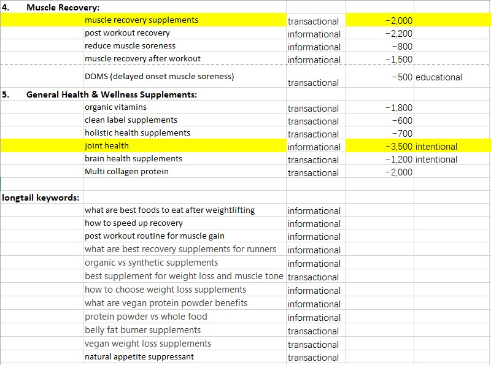

SEO Project for Suppslocker

A Persona of Suppslocker.

Gender: male

Age: 25-35

Education: college and higher

Interests: sports, training, health, healthy food, fitness equipment.

Discover channel: online search, instagram, tiktok, word of mouth.

Location: major UK urban areas with access to gyms 

Issues to solve: faster recovery and enhanced performance for sports; to build lean mass and cut fat; reduce nutritional gaps and maintain health.

Behavioral patterns: online shopping; influencer trust; quality conscious and self-educated; less likely to search cheap product (focus on quality).

Allen is a health-driven, college-educated male aged 30, residing in Manchester urban centre with easy gym access. Deeply immersed in fitness culture, he prioritises athletic performance, lean muscle growth, and efficient recovery. Nutritionally aware, he actively seeks solutions to bridge dietary gaps and optimise body composition—focusing on fat loss and sustained vitality. His interests span sports science, gym equipment, and clean nutrition, driving him to self-educate on ingredients and efficacy. Digitally-engaged, he discovers products via online searches, fitness influencers on Instagram/TikTok, and peer recommendations. While quality-conscious and wary of cheap alternatives, he trusts expert reviews and brand authenticity. As an online shopper, he invests in premium supplements that deliver tangible results, valuing transparency, scientific backing, and seamless e-commerce experiences. His purchasing behaviour reflects a commitment to long-term fitness goals over short-term savings.

SEO audit for: https: //www.suppslocker.co.uk/

1.	website identification
   
https: //www.suppslocker.co.uk/
Industry: e-commerce
Products: supplement for athletes
Pages: 78

3.	pros& cons

Pros: 

Technical: 

Security (HTTPS)
Mobile-friendly
Xml sitemap
 
On-page: 

			Relevant and concise title tags
			Detailed content and eligible visual materials
			Relevant keywords

Cons: 

Technical: 

			No (clear) html sitemap
			
On-page: 

      Has blog page with no content
			No content marketing 
      Some pages lack of metadata, and duplicate metadata and H1 
      No long-tail keyword targeting
      No UGC

Off-page: 

			No good backlinks
			No social media

SEO Pitch- Opportunities

1.	metadata and title

Issue: pages have duplicate meta descriptions and titles, or lack of them
Reason: specific data points search engines and users to understand site content.
Solution: optimize metadata and titles.

2.	Long-Tail Keyword

Issue: The site misses out on content that could target long-tail searches
Reason: long tail keywords help site stands from mass market competitors
Solution: Add a blog or guides section 
Link internally to product and category pages

3.	Backlinks

Issue: SuppsLocker lacks link equity and buys low quality backlinks
Reason: Good backlinks help site rankings and bring more visitors 
Solution:  Influencer outreach. 
Product review partnerships with UK supplement bloggers.
Sponsorships or affiliate programs to incentivize backlinks.

4.	Content marketing

Issue: suppslockers has a blog page with no content 
Reason: Good content attracts visitors and improves rankings; helps to get more backlinks.
Solution: many content in product pages can be separated as blog materials for education or guides.

5.	User generated content

Issue: suppslockers has review area with no content.
Reason: build customer engagement, trust and testimony.
Solution: invite customers to post reviews, with rewards if needed.

6.	Social media

Issue: suppslockers has only Instagram (TikTok, Facebook are needed)
Reason: to attract visitors; reach potential customers; expend content life span.
Solution: own social media and actively maintain to build engagement.

Result: By addressing key SEO opportunities—such as optimizing metadata, targeting long-tail keywords through blogs, building high-quality backlinks, repurposing existing content for guides, encouraging customer reviews, and launching active social media channels—SuppsLocker can significantly boost its online visibility and authority in the UK supplement market. These improvements would establish SuppsLocker as a trusted, expert-driven brand and create a sustainable path for growth without competing directly on budget with major players like MyProtein.

SEO Metrics Questionnaire

1.	Who are your target customers?
2.	What are your goals for the website?
3.	Did you work with any seo agency before?
4.	Do you still hold any previous work with seo agency?
5.	Do you use any seo platform? 
6.	Do you have your own seo related data to share?
7.	Do you have any keywords list?
8.	Are there any specific key words you want to rank for?
9.	What are your best sellers?
10.	Do you plan to work on your blog page?
11.	Do you plan to own more social media?
12.	Do you plan to work with influencers?
13.	Do you plan to work on backlinks?
14.	Do you have any event (you hold/attended) materials?
15.	Do you want to rank locally or globally? 

Keyword Research

Keywords list

Hd muscle
Amino acids supplement
Organic protein powder
Protein supplement
Whey protein
Protein for muscle gain
Complete supplement
Natural protein powder
Multi collagen protein
supplement
Thermo lipid
Eaa
essential amino acids
Eaa protein
EAAs for athletes
EAAs for fatigue
Vegan essential amino acid sources
Top EAA brands
Vegan EAA supplement
EAAs post-workout
EAAs pre-workout
EAAs during workout
EAA for endurance athletes
Burn hd
plant based protein powder
muscle gain
vegan protein powder 
protein powder benefits
natural appetite suppressant
fat burners
fat burning supplements
weight loss supplements
pre workout
organic vitamins
clean label supplements
holistic health supplements
muscle recovery supplements
post workout recovery
reduce muscle soreness
protein after workout
DOMS (delayed onset muscle soreness)
muscle recovery after workout
joint health
brain health supplements

Keywords analysis

Keywords & Competitors

Competitors Analysis

Opportunities for Supplocker

1.	Category pages need strong, keywords focused titles.
2.	Optimize duplicated titles and H1s.
3.	Utilize blog page.
4.	Build internal links in blogs to product pages.
5.	Invite users to post reviews

Internal Content Audit

Opportunities for Supplocker

1.	Generate keyword-rich titles (<60 characters) and CTA-driven meta descriptions for every product.
2.	Add a "Science Behind" section citing 2-3 clinical studies with dosage specifications.
3.	Integrate Trustpilot reviews + incentivize user-generated video testimonials.
4.	Insert 3-5 contextual product links in descriptions + create a "Supplement Stack Guide".

